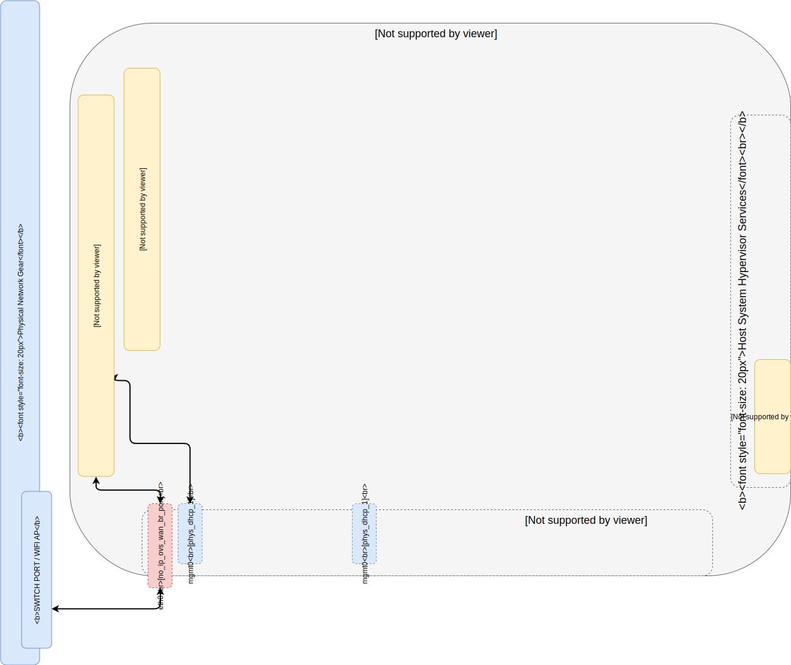

# Part 1 -- Single Port Host Open vSwitch Network Configuration
#### Provision a host virtual entry network viable for cloud scale emulation and testing.
WARNING: Exercise caution when performing this procedure remotely as this may cause loss of connectivity.    

-------
## Prerequisites:
- [Part 0 Host System Prep]

>
> Overview of Steps:
> - Install required packages
> - Enable Open vSwitch Service & Confirm running status
> - Create base OVS Bridge for interfacing with local physical network
> - Create a virtual host ethernet port on the 'external' bridge
> - Impliment 'systemd-networkd' workaround RE: [BUG: 1728134]



-------
#### 01. Install && enable OpenVSwitch Package
```sh
dnf install -y openvswitch network-scripts
systemctl enable network
systemctl enable openvswitch
systemctl disable NetworkManager
```
#### 02. Write physical network ingress port ifcfg Config [EG: 'eth0']
  - NOTE: export name of nic device your primary host network traffic will traverse (EG: 'eth0' in this example)
```sh
export external_NIC="eth0"
```
```sh
cat <<EOF >/etc/sysconfig/network-scripts/ifcfg-${external_NIC}
HOTPLUG=no
ONBOOT="yes"
BOOTPROTO="none"
TYPE="OVSPort"
DEVICETYPE="ovs"
NM_CONTROLLED="no"
UUID=$(uuidgen ${external_NIC})
OVS_BRIDGE="external"
NAME="${external_NIC}"
DEVICE="${external_NIC}"
EOF
```
#### 03. Write OVS  Bridge 'external' ifcfg Config
```sh
export iface_MACADDR=$(echo "${HOSTNAME} ${ministack_SUBNET} external" | md5sum | sed 's/^\(..\)\(..\)\(..\)\(..\)\(..\).*$/02\:\1\:\2\:\3\:\4\:\5/')
```
```sh
cat <<EOF >/etc/sysconfig/network-scripts/ifcfg-external
DELAY=0
HOTPLUG=no
IPV6INIT=no
ONBOOT="yes"
NAME="external"
DEVICE="external"
BOOTPROTO=static
NM_CONTROLLED="no"
DEVICETYPE="ovs"
TYPE="OVSBridge"
OVSBOOTPROTO="static"
OVSBOOTPROTO="static"
UUID=$(uuidgen internal)
OVS_EXTRA="set bridge \$DEVICE other-config:hwaddr=\$MACADDR"
GATEWAY="${ip r | grep -v "127.0" | awk '/default /{print $3}' | head -n 1}"
IPADDR="${ip r | grep -v "127.0" | awk '/default /{print $5}' | head -n 1}"
MACADDR="${iface_MACADDR}"
NETMASK="255.255.255.0"
EOF
```
#### 04. Write OVS bridge 'internal' ifcfg Config
```sh
export iface_MACADDR=$(echo "${HOSTNAME} ${ministack_SUBNET} internal" | md5sum | sed 's/^\(..\)\(..\)\(..\)\(..\)\(..\).*$/02\:\1\:\2\:\3\:\4\:\5/')
```
````sh
cat <<EOF >/etc/sysconfig/network-scripts/ifcfg-internal
DELAY=0
HOTPLUG=no
IPV6INIT=no
ONBOOT="yes"
NAME="internal"
DEVICETYPE="ovs"
DEVICE="internal"
TYPE="OVSBridge"
BOOTPROTO="static"
NM_CONTROLLED="no"
OVSBOOTPROTO="static"
UUID=$(uuidgen external)
OVS_EXTRA="set bridge \$DEVICE other-config:hwaddr=\$MACADDR"
GATEWAY="${ip r | grep -v "127.0" | awk '/default /{print $3}' | head -n 1}"
IPADDR="${ip r | grep -v "127.0" | awk '/default /{print $5}' | head -n 1}"
MACADDR="${iface_MACADDR}"
NETMASK="255.255.255.0"
EOF
````
#### 08. Add OVS Orphan Port Cleaning Utility
NOTE: Use command `ovs-clear` to remove orphaned 'not found' ports as needed
````sh
cat <<EOF >/usr/bin/ovs-clear
#!/bin/bash
# ovs-clear - This script will search and destroy orphaned ovs port
for i in \$(ovs-vsctl show | awk '/error: /{print \$7}'); do
    ovs-vsctl del-port \$i;
done
clear && ovs-vsctl show
EOF
````
````sh
chmod +x /usr/bin/ovs-clear && ovs-clear
````
#### 09. Build OVS Bridge external and apply configuration
````sh
cat <<EOF >/tmp/external-setup
ovs-vsctl add-br external
systemctl stop NetworkManager
systemctl stop network
systemctl stop openvswitch
systemctl start openvswitch
systemctl start network
ovs-clear
EOF
````
````sh
source /tmp/external-mgmt0-setup
````
#### 10. Build OVS Bridge internal and apply configuration
````sh
cat <<EOF >/tmp/internal-setup
ovs-vsctl add-br internal
systemctl restart network
ovs-clear
EOF
````
````sh
source /tmp/internal-setup
````
-------
## Next sections
- [Part 2 LXD On Open vSwitch Network]
- [Part 3 LXD Gateway & Firwall for Open vSwitch Network Isolation]
- [Part 4 KVM On Open vSwitch]
- [Part 5 MAAS Region And Rack Server on OVS Sandbox]
- [Part 6 MAAS Connect POD on KVM Provider]
- [Part 7 Juju MAAS Cloud]
- [Part 8 OpenStack Prep]

<!-- Markdown link & img dfn's -->
[BUG: 1728134]: https://bugs.launchpad.net/netplan/+bug/1728134
[Part 0 Host System Prep]: ../0_Host_System_Prep
[Part 1 Single Port Host OVS Network]: ../1_Single_Port_Host-Open_vSwitch_Network_Configuration
[Part 2 LXD On Open vSwitch Network]: ../2_LXD-On-OVS
[Part 3 LXD Gateway & Firwall for Open vSwitch Network Isolation]: ../3_LXD_Network_Gateway
[Part 4 KVM On Open vSwitch]: ../4_KVM_On_Open_vSwitch
[Part 5 MAAS Region And Rack Server on OVS Sandbox]: ../5_MAAS-Rack_And_Region_Ctl-On-Open_vSwitch
[Part 6 MAAS Connect POD on KVM Provider]: ../6_MAAS-Connect_POD_KVM-Provider
[Part 7 Juju MAAS Cloud]: ../7_Juju_MAAS_Cloud
[Part 8 OpenStack Prep]: ../8_OpenStack_Deploy
