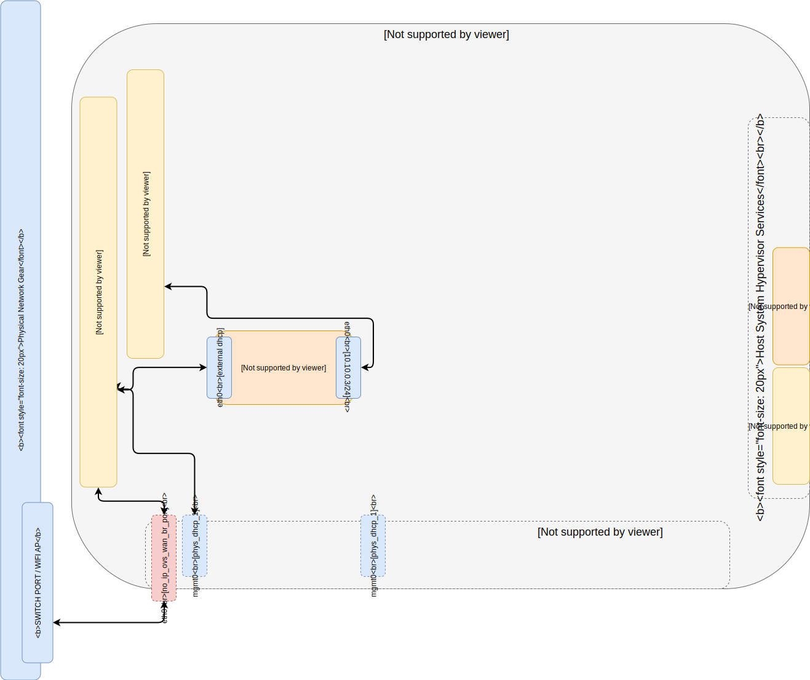

# Part 03 -- Build 'cloudctl' LXD Cloud Controller Bastion
###### Build LXD Bastion for operating the mini-stack cloud
-------
## Prerequisites:
- [Part 00 Host System Prep]
- [Part 01 Single Port Host OVS Network Config]
- [Part 02 LXD On Open vSwitch Networks]

-------
#### 01. Build CloudCTL Profile
````sh
wget -qO- https://git.io/fjXVP | bash
````
#### 02. Build CloudCtl Container
````sh
lxc launch images:fedora/29 cloudctl -p cloudctl
lxc file push /tmp/cloudctl-fedora-init.sh cloudctl/tmp/cloudctl-fedora-init.sh
lxc exec cloudctl -- /bin/bash -c 'source /tmp/cloudctl-fedora-init.sh'
lxc file push /etc/ccio/mini-stack/profile cloudctl/etc/ccio/mini-stack/
````
  - NOTE: wait for cloud-init to finish configuring the container, this may take some time...
#### 03. Import CloudCtl ssh keys on host
````sh
lxc exec cloudctl -- /bin/bash -c "cat /home/${ministack_UNAME}/.ssh/id_rsa.pub" >>/root/.ssh/authorized_keys
````
#### 04. Set User Password
````sh
lxc exec cloudctl -- passwd ${ministack_UNAME}
````
-------
## OPTIONAL: Install Gnome Desktop & xRDP for Remote GUI Control
#### OPT 01. Launch LXD Ubuntu Desktop Environment + xRDP Setup Script
```sh
lxc stop cloudctl; sleep 1; lxc snapshot cloudctl pre-gui-config; lxc start cloudctl
lxc exec cloudctl -- /bin/bash -c 'source /root/mini-stack/03_Cloud_Controller_Bastion/aux/fedora-xrdp-setup.sh'
lxc start cloudctl ; sleep 4 ; lxc list
```
  - NOTE: Desktop Environment consumes an additional 1.5GB RAM & 2GB Disk Space
#### OPT 02. CloudCTL is now accessible over RDP via it's IP address
-------
## Next Sections 
- [Part 04 LXD Network Gateway]
- [Part 05 MAAS Region And Rack Controller]
- [Part 06 Install Libvirt/KVM on OVS Networks]
- [Part 07 MAAS Libvirt POD Provider]
- [Part 08 Juju MAAS Cloud Provider]
- [Part 09 Build OpenStack Cloud]
- [Part 10 Build Kubernetes Cloud]

<!-- Markdown link & img dfn's -->
[Part 00 Host System Prep]: ../00_Host_System_Prep
[Part 01 Single Port Host OVS Network Config]: ../01_Single_Port_Host_OpenVSwitch_Config
[Part 02 LXD On Open vSwitch Networks]: ../02_LXD_On_OVS
[Part 03 Build CloudCTL LXD Bastion]: ../03_Cloud_Controller_Bastion
[Part 04 LXD Network Gateway]: ../04_LXD_Network_Gateway
[Part 05 MAAS Region And Rack Controller]: ../05_MAAS_Region_And_Rack_Controller
[Part 06 Install Libvirt/KVM on OVS Networks]: ../06_Libvirt_On_Open_vSwitch
[Part 07 MAAS Libvirt POD Provider]: ../07_MAAS_Libvirt_Pod_Provider
[Part 08 Juju MAAS Cloud Provider]: ../08_Juju_MaaS_Cloud_Configuration
[Part 09 Build OpenStack Cloud]: ../09_OpenStack_Cloud
[Part 10 Build Kubernetes Cloud]: ../10_Kubernetes_Cloud
