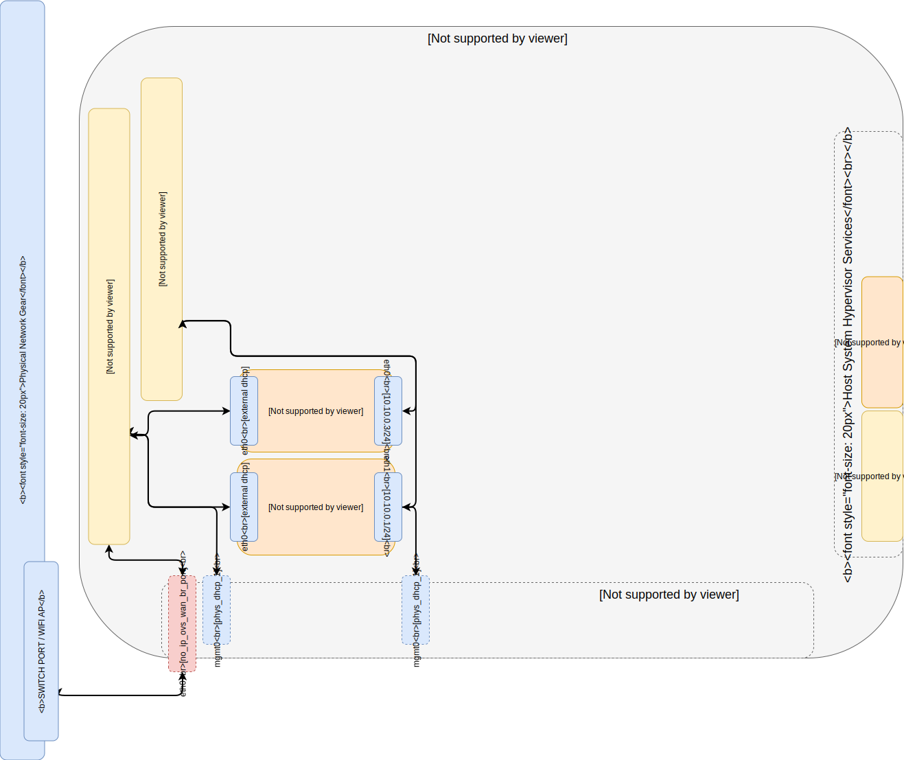

# Part 3 -- LXD Gateway & Firewall for Open vSwitch Network Isolation
###### Create a sandboxed network environment with OpenVSwitch and an LXD Gateway using the [Unofficial OpenWRT LXD Project](https://github.com/containercraft/openwrt-lxd)

-------
Prerequisites:
- [Part 00 Host System Prep]
- [Part 01 Single Port Host OVS Network Config]
- [Part 02 LXD On Open vSwitch Networks]
- [Part 03 Build CloudCTL LXD Bastion]



-------
#### 01. Add the BCIO Remote LXD Image Repo
````sh
lxc remote add bcio https://images.braincraft.io --public --accept-certificate
````
#### 02. Create OpenWRT LXD Profile
````sh
lxc profile copy original openwrt
lxc profile set openwrt security.privileged true
lxc profile device set openwrt eth0 nictype bridged
lxc profile device set openwrt eth0 parent external
lxc profile device add openwrt eth1 nic nictype=bridged parent=internal
````
#### 03. Launch Gateway
````sh
lxc launch bcio:openwrt gateway -p openwrt
lxc exec gateway -- /bin/bash -c "sed -i 's/192.168.1/${ministack_SUBNET}/g' /etc/config/network"
lxc restart gateway
````
  - NOTE: use `watch -c lxc list` to monitor and ensure you get both internal & external IP's on the gateway
#### 04. Apply CCIO Configuration + http squid cache proxy
````sh
wget -qO- http://${ministack_SUBNET}.3/mini-stack/04_LXD_Network_Gateway/aux/bin/run-gateway-config | bash
````
  - WARNING: DO NOT LEAVE EXTERNAL WEBUI ENABLED ON UNTRUSTED NETWORKS
#### 05. Move Default route & DNS from mgmt0 to mgmt1 iface
````sh
cat <<EOF >> /etc/netplan/80-mgmt1.yaml
      gateway4: ${ministack_SUBNET}.1
      nameservers:
        search: [maas, mini-stack.maas]
        addresses: [${ministack_SUBNET}.10,8.8.8.8]
EOF
````
````sh
sed -i -e :a -e '$d;N;2,4ba' -e 'P;D' /etc/netplan/80-mgmt0.yaml
````
#### 06. Reload host network configuration
````sh
systemctl restart systemd-networkd.service && netplan apply --debug
````
#### 07. Copy LXD 'default' profile to 'external'
````sh
lxc profile copy default external
````
#### 08. Set LXD 'default' profile to use the 'internal' network
````sh
lxc profile device set default eth0 parent internal
````
#### 09. Reboot Host
````sh
reboot
````
#### 10. Test OpenWRT WebUI Login on 'external' IP Address    
  - CREDENTIALS: [USER:PASS] [root:admin] -- [http://gateway_external_ip_addr:8080/](http://gateway_external_ip_addr:8080/)

-------
#### OPTIONAL: Enable your new 'internal' network on a physical port. (EG: eth1)
````sh
export internal_NIC="eth1"
````
````sh
cat <<EOF > /etc/systemd/network/${internal_NIC}.network                                                    
[Match]
Name=${internal_NIC}

[Network]
DHCP=no
IPv6AcceptRA=no
LinkLocalAddressing=no
EOF
````
````sh
ovs-vsctl add-port internal ${internal_NIC}
systemctl restart systemd-networkd.service
````

-------
## Next sections
- [Part 05 MAAS Region And Rack Controller]
- [Part 06 Install Libvirt/KVM on OVS Networks]
- [Part 07 MAAS Libvirt POD Provider]
- [Part 08 Juju MAAS Cloud Provider]
- [Part 09 Build OpenStack Cloud]
- [Part 10 Build Kubernetes Cloud]

<!-- Markdown link & img dfn's -->
[Part 00 Host System Prep]: ../00_Host_System_Prep
[Part 01 Single Port Host OVS Network Config]: ../01_Single_Port_Host_OpenVSwitch_Config
[Part 02 LXD On Open vSwitch Networks]: ../02_LXD_On_OVS
[Part 03 Build CloudCTL LXD Bastion]: ../03_Cloud_Controller_Bastion
[Part 04 LXD Network Gateway]: ../04_LXD_Network_Gateway
[Part 05 MAAS Region And Rack Controller]: ../05_MAAS_Region_And_Rack_Controller
[Part 06 Install Libvirt/KVM on OVS Networks]: ../06_Libvirt_On_Open_vSwitch
[Part 07 MAAS Libvirt POD Provider]: ../07_MAAS_Libvirt_Pod_Provider
[Part 08 Juju MAAS Cloud Provider]: ../08_Juju_MaaS_Cloud_Configuration
[Part 09 Build OpenStack Cloud]: ../09_OpenStack_Cloud
[Part 10 Build Kubernetes Cloud]: ../10_Kubernetes_Cloud
