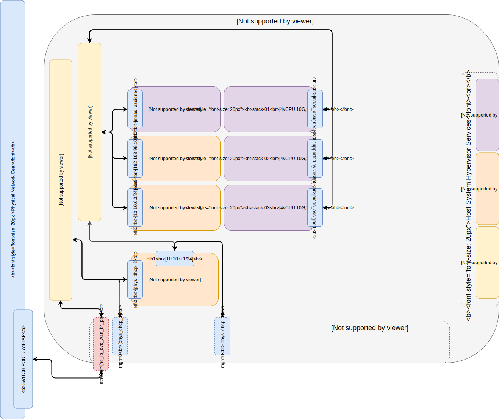

# Part 8 -- OpenStack Prep
###### Provision OpenStack Deployment Requirements

Prerequisites:
- [Part 0 Host System Prep]
- [Part 1 Single Port Host OVS Network]
- [Part 2 LXD On Open vSwitch Network]
- [Part 3 LXD Gateway & Firwall for Open vSwitch Network Isolation]
- [Part 4 KVM On Open vSwitch]
- [Part 5 MAAS Region And Rack Server on OVS Sandbox]
- [Part 6 MAAS Connect POD on KVM Provider]
- [Part 7 Juju MAAS Cloud]



-------
#### 00. Stage Virt-Install VM Standup Script (on host)
```
wget -qO /tmp/virt-inst-stack-nodes http://${ministack_SUBNET}.3/mini-stack/09_OpenStack_Cloud/aux/virt-inst-stack-nodes.sh
```
  - NOTE: Defaults set in script hardware profile section should be adjusted as required in /tmp/virt-inst-stack-nodes
#### 01. Run Virt-Install VM Standup Script (on host)
```
source /tmp/virt-inst-stack-nodes
```

#### 02. Discover new KVM VIrtual Machines via PODS Refresh  (on host)
```
lxc exec maasctl -- maas-nodes-discover
```

#### 03. Tag new mini-stack nodes (on host)
```
lxc exec maasctl -- /bin/bash -c "wget -qO- http://${ministack_SUBNET}.3/mini-stack/09_OpenStack_Cloud/aux/maas-tag-nodes | bash"
```
#### 05. Add Juju Machines (on cloudctl)
```sh
lxc ${ministack_UNAME} cloudctl
for n in 01 02 03; do juju add-machine --constraints tags=mini-stack; done
```
#### 06. Deploy OpenStack from Juju Bundle YAML File (on cloudctl)
```sh
wget -qO- http://${ministack_SUBNET}.3/mini-stack/09_OpenStack_Cloud/aux/build-stein-ccio-openstack-juju-bundle.sh | bash
juju deploy /tmp/stein-ccio-openstack-bundle.yaml --map-machines=existing --verbose --debug
```
#### 07. Monitor Deploy (on cloudctl)
```sh
watch -c juju status --color
juju debug-log
```
#### 07. Find Horizon Dashboard IP && Login to OpenStack Horizon WebUI
```sh
clear; juju status openstack-dashboard | grep -E "openstack-dashboard" | grep "${ministack_SUBNET}"
```
  - NOTE: Default Credentials [admin:admin]
#### 07. Click on "admin" user menu drop down in top right
#### 00. Click on "OpenStack RC File" to download your admin-openrc.sh credentials
#### 00. In CloudCtl Terminal Load admin-openrc.sh
```sh
source ~/Downloads/admin-openrc.sh
```
#### 00. Test OS Cli
```sh
openstack hypervisor list
```
#### 00. Add External Provider Network
```sh
openstack network create --enable --external --no-default --provider-network-type flat --provider-physical-network physnet1 ext_net
openstack subnet create --allocation-pool start=${ministack_SUBNET}.40,end=${ministack_SUBNET}.49 --subnet-range ${ministack_SUBNET}.0/24 --no-dhcp --gateway ${ministack_SUBNET}.1 --ip-version
4 --network ext_net ext_net_subnet
```
#### 00. Enable SSH Globally
```sh
openstack security group rule create default --protocol tcp --dst-port 22:22 --remote-ip 0.0.0.0/0 --egress
openstack security group rule create default --protocol tcp --dst-port 22:22 --remote-ip 0.0.0.0/0 --ingress
```
#### 00. Enable SSH Globally
```sh
openstack security group rule create default --protocol icmp --egress
openstack security group rule create default --protocol icmp --ingress
```
#### 00. Create OS Flavor Types
```sh
openstack flavor create --public --ram 2048 --disk 8 --vcpus 2 --swap 0 m2.2small
openstack flavor create --public --ram 4096 --disk 32 --vcpus 2 --swap 0 m2.4med
openstack flavor create --public --ram 4096 --disk 32 --vcpus 4 --swap 0 m4.4med
```
#### 00. Create Ubuntu Bionic Image
```sh
wget https://cloud-images.ubuntu.com/bionic/current/bionic-server-cloudimg-amd64.img -P ~/Downloads/
openstack image create --public --disk-format raw --container-format bare --file ~/Downloads/bionic-server-cloudimg-amd64.img bionic-cloud-image
```


- [Part 9 Kubernetes Deploy]
<!-- Markdown link & img dfn's -->
[Part 0 Host System Prep]: ../0_Host_System_Prep
[Part 1 Single Port Host OVS Network]: ../1_Single_Port_Host-Open_vSwitch_Network_Configuration
[Part 2 LXD On Open vSwitch Network]: ../2_LXD-On-OVS
[Part 3 LXD Gateway & Firwall for Open vSwitch Network Isolation]: ../3_LXD_Network_Gateway
[Part 4 KVM On Open vSwitch]: ../4_KVM_On_Open_vSwitch
[Part 5 MAAS Region And Rack Server on OVS Sandbox]: ../5_MAAS-Rack_And_Region_Ctl-On-Open_vSwitch
[Part 6 MAAS Connect POD on KVM Provider]: ../6_MAAS-Connect_POD_KVM-Provider
[Part 7 Juju MAAS Cloud]: ../7_Juju_MAAS_Cloud
[Part 8 OpenStack Prep]: ../8_OpenStack_Deploy
[Part 9 Kubernetes Deploy]: ../9_Kubernetes_Deploy
